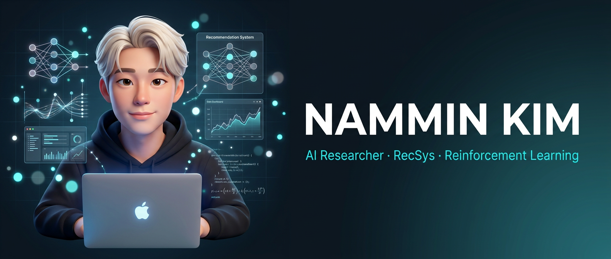

<!-- ░░░░░░░░░░░░░░░░░░░░  HEADER  ░░░░░░░░░░░░░░░░░░░░ -->
<p align="center">
  
</p>

<p align="center">
  <a href="https://git.io/typing-svg">
    
  </a>
</p>

<!-- ░░░░░░░░░░░░░░░░░░░░  SOCIAL  ░░░░░░░░░░░░░░░░░░░░ -->
<p align="center">
  <a href="https://astonkim.vercel.app/"></a>
  <a href="https://www.linkedin.com/in/%EB%82%A8%EB%AF%BC-%EA%B9%80-0870b0394/"></a>
  <a href="mailto:knm9907@dgu.ac.kr"></a>
  <a href="https://github.com/0xn4mmin"></a>
</p>

<p align="center">
  
  
</p>

<br/>

<!-- ░░░░░░░░░░░░░░░░░░░░  ABOUT  ░░░░░░░░░░░░░░░░░░░░ -->
## 🧠 whoami

```python
class NamminKim:
    def __init__(self):
        self.name        = "Nammin Kim (남민 김)"
        self.role        = "Graduate Researcher in RecSys & Data Science"
        self.affiliation = "Hanyang University — Ph.D. (AI)"
        self.research    = ["Recommendation Systems", "Reinforcement Learning", "Data Science"]
        self.focus       = ["user–item interactions", "sequential decision-making", "scalable learning systems"]

    def motto(self) -> str:
        return "I'm not the most talented — so I practice, practice and practice. ⚡"
```

> Hello, world. 👋 I'm **Nammin**, a Ph.D. student at **Hanyang University** focusing on
> **recommendation systems, reinforcement learning, and data science**. I previously earned dual bachelor's
> degrees in **Data Science Software** and **Business Administration** at Dongguk University.
> My research centers on **modeling user–item interactions, sequential decision-making, and scalable learning systems**.

<br/>

<!-- ░░░░░░░░░░░░░░░░░░░░  TECH STACK  ░░░░░░░░░░░░░░░░░░░░ -->
## 🛠️ Tech Stack

**Programming**


**Deep Learning & RL**


**Data Analysis & Viz**


**Web Scraping**


<br/>

<!-- ░░░░░░░░░░░░░░░░░░░░  FEATURED RESEARCH  ░░░░░░░░░░░░░░░░░░░░ -->
## 🔬 Featured Research & Projects

<table>
  <tr>
    <td width="80" align="center">🟢<br/><b>On-going</b></td>
    <td>
      <b>Live-Stream Recommendation for NAVER CHZZK</b><br/>
      A <b>competition-aware BPRMF</b> (negatives sampled from concurrently-live streamers) fused with
      <b>LLM-generated streamer-description text embeddings</b> (<i>TextFusion</i>) to tackle cold-start.
      Adds <b>walk-forward continual learning</b> for recency, evaluated with ranking metrics (HR / NDCG / coverage)
      and qualitative nearest-neighbor analysis of the learned embeddings.
      <br/><sub>🏷️ RecSys · BPRMF · LLM Embeddings · Continual Learning</sub>
    </td>
  </tr>
  <tr>
    <td align="center">🟢<br/><b>On-going</b></td>
    <td>
      <b>Physics-Informed Generative AI for Weather Forecasting — Hanyang × INEEJI</b><br/>
      Multi-year project (2026–2029) with <b>INEEJI</b>, in collaboration with the
      <b>Korea Meteorological Administration (KMA)</b>: physics-knowledge-driven generative AI for large-scale
      spatio-temporal forecasting. Leading the <b>weather-domain graph schema design</b> and
      <b>graph-based spatio-temporal numerical prediction</b> on INEEJI-provided meteorological data —
      physics-informed GNNs & knowledge graphs for numerical weather prediction (NWP) and error modeling.
      <br/><sub>🏷️ Generative AI · Physics-Informed GNN · Spatio-Temporal · NWP</sub>
    </td>
  </tr>
  <tr>
    <td width="80" align="center"><b>2025</b></td>
    <td>
      <b>CSKD-PPO — Hierarchical Multi-Agent Portfolio Management</b><br/>
      Multi-agent RL framework tackling the data-silo problem with a novel <b>Cross-Segment Knowledge Distillation</b>
      mechanism for bidirectional transfer across Large/Mid/Small-cap market segments.
      <br/><sub>🏷️ Multi-Agent RL · PPO · Knowledge Distillation</sub>
    </td>
  </tr>
  <tr>
    <td align="center"><b>2024</b></td>
    <td>
      <b>Optimal Portfolio Construction via Deep Q-Network (DQN)</b><br/>
      Hierarchical deep RL for automated portfolio management, segmenting stocks by market cap & industry, with
      sector-level diversity via a <b>hierarchical softmax</b> strategy.
      <br/><sub>🏷️ DQN · Deep RL · Quant Finance</sub>
    </td>
  </tr>
  <tr>
    <td align="center"><b>2023</b></td>
    <td>
      <b>YouTube Home-Training Engagement during COVID-19</b><br/>
      Quantitative study on participation motivation → satisfaction, exercise adherence & continued-viewing intention,
      modeled with <b>structural equation modeling (SEM)</b>.
      <br/><sub>🏷️ SEM · Behavioral Analytics</sub>
    </td>
  </tr>
  <tr>
    <td align="center"><b>2022</b></td>
    <td>
      <b>Determinants of Apartment Prices — Random Forest</b><br/>
      Feature-importance analysis of Seoul-metro apartment prices, integrating macroeconomic, housing-supply, and
      demographic variables.
      <br/><sub>🏷️ Random Forest · Feature Importance</sub>
    </td>
  </tr>
  <tr>
    <td align="center"><b>2022</b></td>
    <td>
      <b>YouTube Channel Growth Determinants &nbsp;·&nbsp; Hotel Price Crawler</b><br/>
      Large-scale scraping of top channels across categories to find growth factors; plus an automated tool
      aggregating & comparing Korean hotel prices across booking platforms.
      <br/><sub>🏷️ Web Scraping · Data Pipeline</sub>
    </td>
  </tr>
</table>

<br/>

<!-- ░░░░░░░░░░░░░░░░░░░░  EXPERIENCE  ░░░░░░░░░░░░░░░░░░░░ -->
## 💼 Experience

- **Teaching Assistant** — Korea IT Academy *(Jun 2023 – Dec 2023)*
  Lab assistant for an intensive Python summer course; hands-on guidance for **30+ students** in data structures,
  algorithms & coding exercises; built supplementary materials and debugging sessions.
- **Individual Tutor** *(Feb 2024 – Nov 2024)*
  Designed a curriculum on Python, web scraping & project-based learning; tutored high-school and university students
  in data analysis and ML basics with customized materials.

<br/>

<!-- ░░░░░░░░░░░░░░░░░░░░  GITHUB STATS  ░░░░░░░░░░░░░░░░░░░░ -->
## 📊 GitHub Stats

<p align="center">
  
  
</p>

<p align="center">
  
</p>

<br/>

<!-- ░░░░░░░░░░░░░░░░░░░░  BEYOND THE LAB  ░░░░░░░░░░░░░░░░░░░░ -->
## 🌊 Side Quests Outside the Lab

- 🐬 **Freediver & Scuba Diver** — comfortable where it's quiet and deep
- 🧘 **Pilates Instructor** — 8+ years on the mat
- 🗣️ **Medical Translator** — JP ⇄ KR

<sub>`ENTJ` · optimizes mornings like a system pipeline · runs along the Han River 🏃 · removes the noise in code, space & life ✨</sub>

<br/>

<!-- ░░░░░░░░░░░░░░░░░░░░  FOOTER  ░░░░░░░░░░░░░░░░░░░░ -->
<p align="center">
  
</p>
